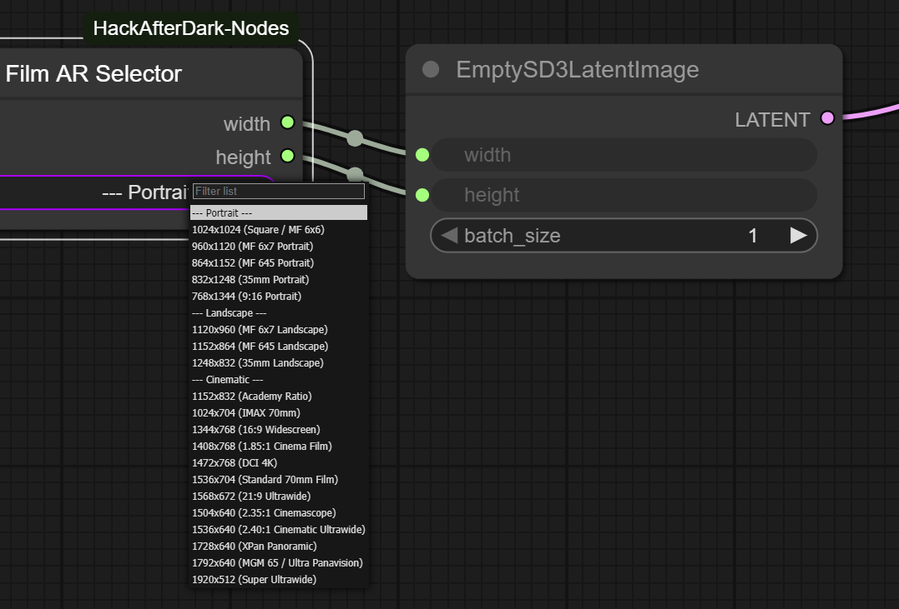

# HackAfterDark Custom Nodes for ComfyUI

Just a few ComfyUI custom nodes that I created for various needs, I hope you find them useful.

# AfterDark Film AR Selector

A custom ComfyUI node that provides a dropdown menu of preset resolutions for film and photography aspect ratios. These resolutions are optimized for models with a native resolution of 1024x1024, such as Z-Image Turbo, SDXL, Pony, and Flux.

## Preview



## Features

- **Preset Resolutions**: Select from a curated list of common aspect ratios and resolutions.
- **Easy to Use**: Simply select a preset from the dropdown to output the corresponding width and height.
- **Customizable**: The list of resolutions can be easily modified in the Python script.

## Installation

1. Clone or download this repository into your `ComfyUI/custom_nodes/` folder.
2. Restart ComfyUI.

## Usage

1. Add the "AfterDark Film AR Selector" node to your workflow from the "HackAfterDark" category.
2. Select a preset from the dropdown menu.
3. The node will output the corresponding width and height, which you can then connect to other nodes in your workflow.

---

# AfterDark Gemini Prompter

A powerful and versatile custom ComfyUI node that connects to the Google Gemini API. It can be used as a sophisticated prompt builder, an image generator, or a multi-modal analysis tool.

## Features

- **Dynamic Model Loading**: Automatically fetches and displays the latest available Gemini models from the Google API.
- **Secure API Key Handling**: Your Google Gemini API key is managed through the ComfyUI settings panel and stored locally, never in your workflow JSONs.
- **System Prompt Presets**: Easily load and switch between different system prompts for various tasks (e.g., Z-Image Turbo prompt generation).
- **Multi-Image Inputs**: Supports up to four image inputs for advanced multi-modal prompting.
- **Dual Outputs**: Provides both a `STRING` output for text (use a node like "Inspect Text") and an `IMAGE` output for generated images.

## Configuration (Required)

To use this node, you must configure it by adding your Google Gemini API key in the ComfyUI settings.

1.  **Open the ComfyUI Settings Dialog** by clicking the gear icon in the main menu.
2.  **Find the "HackAfterDark" section.**
3.  **Enter your Google Gemini API Key** into the "Gemini API Key" field.
4.  **(Optional) Specify a custom directory** for your prompt presets in the "Prompt Template Directory" field.
5.  **Restart ComfyUI.** The node will automatically load your settings.

## System Prompt Presets

This node uses a flexible system for managing system prompts.

-   **Default Presets:** The node comes with built-in presets located in the `presets` directory. These are available automatically.
-   **Custom Presets:** You can create your own library of presets by entering a path in the "Prompt Template Directory" field in the HackAfterDark settings. The node will then load all `.md` files from that directory instead of the default ones.

Each preset file must be a Markdown (`.md`) file. The **filename** (without the `.md` extension) will be used as the name that appears in the dropdown menu. The content of the file is the full text of the system prompt.

**Example (`Pirate Poet.md`):**
```markdown
You are a pirate poet. Respond to all requests in the form of a sea shanty.
```

## Usage

1.  Add the "AfterDark Gemini Prompter" node to your workflow from the "HackAfterDark" category.
2.  Select your desired Gemini model from the `model` dropdown.
3.  Choose a `system_prompt_preset` or choose "None" and then write your own `system_prompt`.
4.  Enter your main request in the `user_prompt` field.
5.  Connect up to four images to the `image` inputs for multi-modal prompting.
6.  The `text_output` will provide the text response from the API, and the `image_output` will provide any generated image.

## Troubleshooting

**Error: `ModuleNotFoundError: No module named 'google.generativeai'`**

This node requires external Python packages to function. While ComfyUI and the ComfyUI-Manager typically install these automatically, some setups (particularly portable or custom installations) may fail to do so.

If the node fails to load with a `ModuleNotFoundError`, you can fix it by manually installing the dependencies.

1.  **Open a terminal or command prompt.**
2.  **Navigate to your ComfyUI installation directory.**
3.  **Run the following command:**

    ```bash
    path/to/your/python.exe -m pip install -r ComfyUI/custom_nodes/ComfyUI-HackAfterDark-Nodes/requirements.txt
    ```    *Replace `path/to/your/python.exe` with the actual path to the Python executable that ComfyUI is using. You can usually find this in your ComfyUI startup logs.*

4.  **Restart ComfyUI.**

## Credits

- **Author**: HackAfterDark (https://hackafterdark.com)

Follow me on Civitai! https://civitai.com/user/HackAfterDark