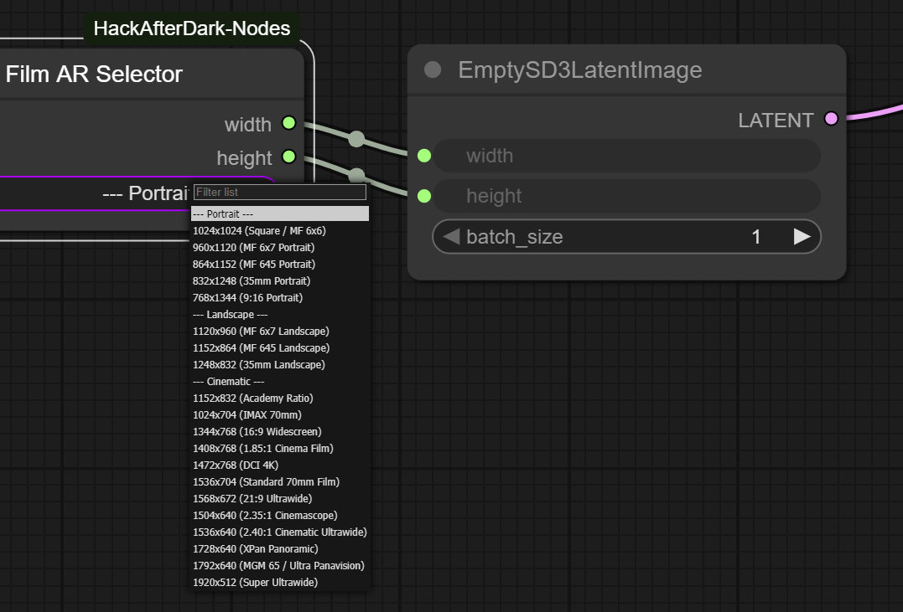
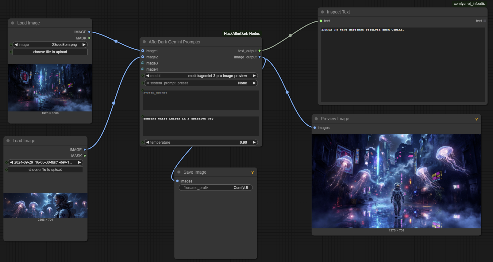

# HackAfterDark Custom Nodes for ComfyUI

Just a few ComfyUI custom nodes that I created for various needs, I hope you find them useful.

# AfterDark Film AR Selector

A custom ComfyUI node that provides a dropdown menu of preset resolutions for film and photography aspect ratios. These resolutions are optimized for models with a native resolution of 1024x1024, such as Z-Image Turbo, SDXL, Pony, and Flux.

## Preview



## Features

- **Preset Resolutions**: Select from a curated list of common aspect ratios and resolutions, including 4:5 Instagram Portrait, 3:4 / 4:3 Classic Photography, film formats, and widescreen options.
- **Manual Numeric Override**: Easily override width and/or height with custom numeric values directly on the node (`custom_width`, `custom_height`).
- **Easy to Use**: Simply select a preset from the dropdown or dial in custom dimensions to output the corresponding width and height.
- **Customizable**: The list of resolutions can be easily modified in the Python script.

## Installation

1. Clone or download this repository into your `ComfyUI/custom_nodes/` folder.
2. Restart ComfyUI.

## Usage

1. Add the "AfterDark Film AR Selector" node to your workflow from the "HackAfterDark" category.
2. Select a preset from the dropdown menu, or specify `custom_width` and/or `custom_height` numeric values to manually override the preset.
3. The node will output the corresponding width and height, which you can then connect to other nodes in your workflow.

---

# AfterDark Gemini Prompter

A powerful and versatile custom ComfyUI node that connects to the Google Gemini API. It can be used as a sophisticated prompt builder, an image generator, or a multi-modal analysis tool.

## Preview



## Features

- **Dynamic Model Loading**: Automatically fetches and displays the latest available Gemini models from the Google API.
- **Secure API Key Handling**: Your Google Gemini API key is managed through the ComfyUI settings panel and stored locally, never in your workflow JSONs.
- **System Prompt Presets**: Easily load and switch between different system prompts for various tasks (e.g., Z-Image Turbo prompt generation).
- **Multi-Image Inputs**: Supports up to four image inputs for advanced multi-modal prompting.
- **Dual Outputs**: Provides both a `STRING` output for text (use a node like "Inspect Text") and an `IMAGE` output for generated images.

## Configuration (Required)

To use this node, you must configure it by adding your Google Gemini API key in the ComfyUI settings.

1.  **Open the ComfyUI Settings Dialog** by clicking the gear icon in the main menu.
2.  **Find the "HackAfterDark" section.**
3.  **Enter your Google Gemini API Key** into the "Gemini API Key" field.
4.  **(Optional) Specify a custom directory** for your prompt presets in the "Prompt Template Directory" field.
5.  **Restart ComfyUI.** The node will automatically load your settings.

## System Prompt Presets

This node uses a flexible system for managing system prompts.

-   **Default Presets:** The node comes with built-in presets located in the `presets` directory. These are available automatically.
-   **Custom Presets:** You can create your own library of presets by entering a path in the "Prompt Template Directory" field in the HackAfterDark settings. The node will then load all `.md` files from that directory instead of the default ones.

Each preset file must be a Markdown (`.md`) file. The **filename** (without the `.md` extension) will be used as the name that appears in the dropdown menu. The content of the file is the full text of the system prompt.

**Example (`Pirate Poet.md`):**
```markdown
You are a pirate poet. Respond to all requests in the form of a sea shanty.
```

## Usage

1.  Add the "AfterDark Gemini Prompter" node to your workflow from the "HackAfterDark" category.
2.  Select your desired Gemini model from the `model` dropdown.
3.  Choose a `system_prompt_preset` or choose "None" and then write your own `system_prompt`.
4.  Enter your main request in the `user_prompt` field.
5.  Connect up to four images to the `image` inputs for multi-modal prompting.
6.  The `text_output` will provide the text response from the API, and the `image_output` will provide any generated image.

## Troubleshooting

**Error: `ModuleNotFoundError: No module named 'google.generativeai'`**

This node requires external Python packages to function. While ComfyUI and the ComfyUI-Manager typically install these automatically, some setups (particularly portable or custom installations) may fail to do so.

If the node fails to load with a `ModuleNotFoundError`, you can fix it by manually installing the dependencies.

1.  **Open a terminal or command prompt.**
2.  **Navigate to your ComfyUI installation directory.**
3.  **Run the following command:**

    ```bash
    path/to/your/python.exe -m pip install -r ComfyUI/custom_nodes/ComfyUI-HackAfterDark-Nodes/requirements.txt
    ```    *Replace `path/to/your/python.exe` with the actual path to the Python executable that ComfyUI is using. You can usually find this in your ComfyUI startup logs.*

4.  **Restart ComfyUI.**


---

# AfterDark Film Grain & Emulsion

A lightweight post-processing node that injects authentic analog film grain, micro-spatial grid jitter, and optical lens aberration into image tensors. Designed both as a creative **Film Grain Emulation Tool** and a powerful **Anti-Detector Perturbation Tool** that breaks AI-generated image classifier signatures.

## Features

- **Film Stock Presets**: 32 built-in emulation profiles modeled after iconic DxO FilmPack and classic analog film stocks:
  * **Color Negative**: Kodak Portra 400, Kodak Portra 800, Kodak Gold 200, Kodak Ektar 100, Kodak ColorPlus 200, Kodak Pro Image 100, Fuji Pro 400H, Fuji Superia X-TRA 400, Agfa Vista 200, Harman Phoenix 200 (Experimental), LomoChrome Metropolis
  * **Color Reversal / Slide**: Kodak Ektachrome 100VS, Fuji Velvia 50, Kodak Kodachrome 64, Agfa Scala 200x (B&W Reversal)
  * **Cinema Motion Picture**: CineStill 800T (Tungsten), CineStill 400D (Daylight), Kodak Vision3 250D (Daylight)
  * **B&W Silver Halide**: Kodak Tri-X 400, Kodak T-Max 3200, Fuji Neopan Acros 100 II, Ilford HP5 Plus 400, Ilford Delta 100, Ilford Delta 3200, Ilford Pan F Plus 50, Fomapan 400, Rollei Retro 80S (Infrared), ADOX CHS 100 II, Lomography Potsdam Kino 100, Lomography Lady Grey 400 (120 Medium Format), Lomography Earl Grey 100
  * **Instant Analog**: Polaroid 600 Emulsion
- **Physical Noise Distributions**: `gaussian` (standard), `poisson` (shot noise), `multiplicative` (dye cloud), and `laplacian` (heavy-tailed halide spikes).
- **Luminance Exposure Response**: Choice of exposure modulation profiles:
  * `Film (Midtone & Shadow)`: Silver halide density curve with heavy grain in shadows/midtones and soft highlight roll-off.
  * `Digital (Shadow Heavy)`: Low Signal-to-Noise Ratio (SNR) digital thermal dark current noise.
  * `Uniform (Flat)`: Equal noise distribution across all brightness levels.
- **Anti-Detector Protections**: Sub-pixel `micro_jitter`, `spatial_resample`, non-linear `gamma_shift`, and `edge_softening` to disrupt Vision Transformer (ViT) patch token classifiers.

## Exposure Response & Luminance Physics

In real physical photography, **film grain is never a uniform noise layer** pasted evenly across an image. 

In physical film stock, grain is the visual result of metallic silver halide crystal clumping and organic C-41 dye cloud formation. Because chemical development reacts differently depending on light exposure, **film grain looks completely different depending on the brightness or darkness of the scene**:

- **Specular Highlights**: Bright highlights saturate into dense metallic silver on negative film, dampening grain variance.
- **Midtones & Shadows**: Midtones and dark shadows exhibit the highest grain density and visual structure.

Without factoring in local pixel luminance, noise applied equally across bright skies, skin tones, and deep shadows immediately looks artificial—like a flat digital overlay rather than authentic analog film emulsion.

### Choosing the Right Exposure Response Mode

| Mode | Real-World Physics | When to Use |
| :--- | :--- | :--- |
| **`Film (Midtone & Shadow)`** *(Default)* | **Analog Silver Halide Emulsion**: Grain density peaks in dark shadows and midtones ($L = 0.1 \to 0.6$) and rolls off smoothly in bright highlights ($L > 0.85$). | **Best for Authentic Film Look**: Use this for film stock emulations (Portra, Ektachrome, Tri-X). Keeps bright skies and specular highlights clean while giving shadows and skin midtones rich, organic film texture. |
| **`Digital (Shadow Heavy)`** | **Digital Sensor Thermal Noise**: Low Signal-to-Noise Ratio (SNR) in dark current causes sensor read noise to dominate dark shadow regions. | **Best for Digital High-ISO Look**: Use when emulating low-light photography shot on digital camera sensors (e.g. DSLR/mirrorless at ISO 6400). Concentrates noise in deep darks ($L < 0.30$). |
| **`Uniform (Flat)`** | **Mathematical Uniform Overlay**: Noise is applied with equal intensity across all pixels, regardless of brightness. | **Best for Anti-Detector Perturbations**: Use when your primary goal is disrupting Vision Transformer (ViT) patch classifiers across every spatial token, or for creative graphic texturing. |

---

# AfterDark Film Optics & Artifacts

Simulates physical camera optical lens falloff, film gate framing, and procedural organic light leaks modeled after real analog film reference photos.

## Features
- **Procedural Organic Light Leaks**: Generated entirely via PyTorch tensor math—no overlay images required! Features 10 authentic real-world film stock leak styles: `C-41 Fiery Core Flare` (red-orange to white-hot yellow core), `Crimson Red Base Burn` (acetate backing leak), `Tungsten Blue Burn` (front-element leak), `Vintage Magenta Leak` (expired film fog), `Sunburst Golden Flare`, `E-6 Slide Solarized Yellow`, `Overexposed White-Hot Flare`, `Anamorphic Prism Diffraction` (glass refraction: Amber $\to$ Rose $\to$ Cyan), `Dual-Tone Cyan & Amber`, and `Random Organic Multi-Layer`.
- **Realistic Film Burn Patterns**: Modeled directly after authentic analog camera light leaks:
  * **`Triple-Chamber Solarized Burn`**: Modeled after heavy tropical beach overexposures featuring a sharp crimson gate bar on the left edge, a massive white-hot solarized yellow blowout in the center sky, and cool blue/magenta edge fogging on the right.
  * **`Dual-Border Holga Leak`**: Modeled after plastic toy cameras (Holga/LOMO) with simultaneous left-side golden flare blob, right-side vertical light column, and top-sky magenta fogging.
  * **`Wide Gate Leak (Asymmetric Bar)`**: Asymmetric wide vertical light band with a sharp right edge boundary (metal film gate shadow), soft left gradient, vertical intensity modulation, mid-strip gap breaks, and a secondary sub-strip flare on the opposite edge.
  * **`Vertical Curtain Gap`**: Vertical light seam running top-to-bottom with soft edge gradients and vertical intensity fluctuations.
  * **`Bottom Frame Burn`**: Fiery upward orange/yellow light flare originating from the bottom edge of the film frame.
  * **`Dual-Edge Cross Burn`**: Multi-layer opposing leaks (warm bottom flare combined with cool upper corner burn).
  * **`Random / Scattered`**, `Center Specular Flare`, `Diagonal Streak`, `Sprocket Hole Leaks`, corners, and edge strips.
- **Seed-Driven Spatial & Organic Randomness**: Setting a seed dynamically randomizes center offsets, ellipse scale/aspect ratios, and non-uniform organic burn cloud shapes!
- **Physical Lens Vignetting**: Physically accurate radial light falloff ($\cos^4 \theta$ optical law) with adjustable intensity and falloff exponents.
- **Film Gate Borders**: Soft film frame gate shading.

---

# AfterDark Film Halation & Bloom

Simulates specular highlight red/orange halation diffusion caused by light reflecting off the film pressure plate back into emulsion layers (famous in *CineStill 800T* and *Harman Phoenix 200*).

## Features
- **Specular Highlight Isolation**: Adjustable threshold to isolate bright light sources ($L > 0.85$).
- **Multi-Scale Gaussian Bloom**: PyTorch spatial downsampling pyramid for resolution-independent diffusion blur.
- **Authentic Spectral Tints**: `Red / Orange (CineStill 800T)`, `Golden Amber`, `Warm Yellow`, and `Soft White`.

---

# AfterDark Film Color Split & Clarity

Split toning and local micro-contrast enhancement for cinematic film grading.

## Features
- **Split Toning**: Independent shadow tint (`Teal / Cyan`, `Deep Blue`, `Emerald Green`, `Warm Sepia`) and highlight tint (`Golden Amber`, `Warm Yellow`, `Peach Rose`, `Cool Cyan`).
- **Micro-Contrast (Clarity)**: High-pass spatial frequency filter to boost local texture without clipping global exposure.

---

# AfterDark Film LUT

A high-performance 3D LUT (Look-Up Table) color grading node. Reads `.cube` LUT files directly from ComfyUI's central `models/luts/` directory.

## Features

- **Central Model Directory Integration**: Loads `.cube` files directly from `ComfyUI/models/luts/` via ComfyUI's standard `folder_paths` manager. Your LUT files are preserved safely across node updates.
- **Built-In Dropdown Search**: Standard ComfyUI combo dropdown select with built-in search filter support for quickly finding files across nested subdirectories.
- **GPU Hardware Acceleration**: Uses PyTorch `torch.nn.functional.grid_sample` for 3D trilinear interpolation on GPU, applying complex LUTs in under 2 milliseconds.
- **Strength / Alpha Blending**: Smooth slider control ($0.0 \to 1.0$) to blend between the original image and the color-graded LUT result.
- **Tone & Lighting Controls**: Includes `contrast` ($0.5 \to 1.5$) for fine-tuning midtone contrast and `black_lift` ($0.0 \to 0.10$) to simulate authentic physical film shadow density (film toe).
- **Color Space Transfers**: Supports `"sRGB (Standard)"`, `"Linear -> sRGB"`, and `"sRGB -> Linear"` gamma transfers to accommodate log/linear film print LUTs.

---

## Credits

- **Author**: HackAfterDark (https://hackafterdark.com)

Follow me on Civitai! https://civitai.com/user/HackAfterDark